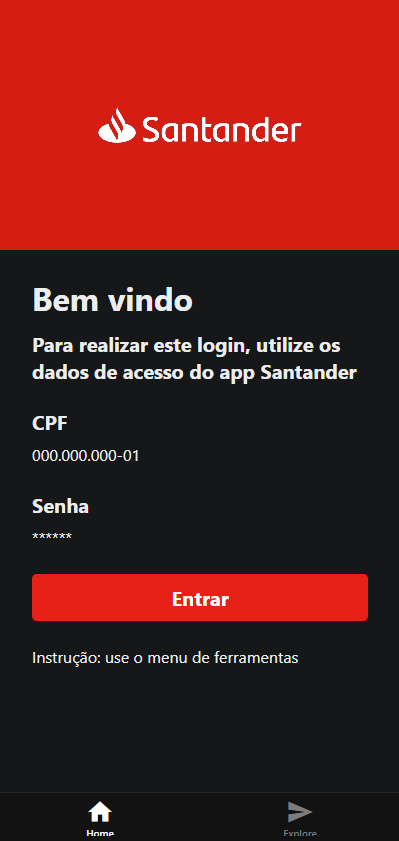
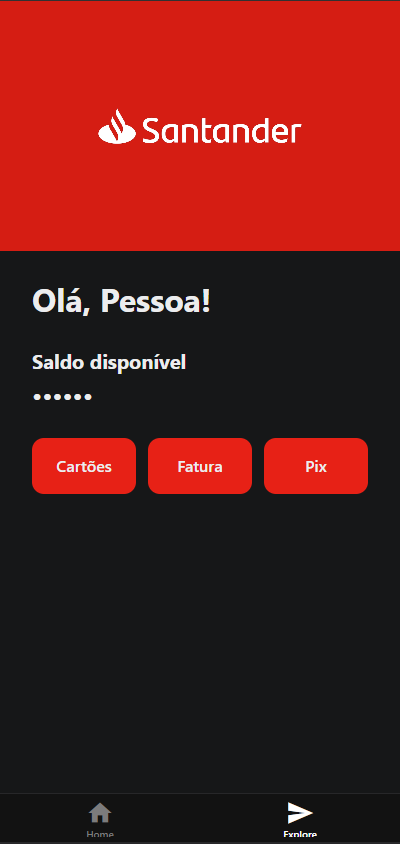

# BANCO DIGITAL REACT NATIVE

 Olá! Este é um projeto de aplicativo mobile que desenvolvi como parte dos meus estudos em desenvolvimento com React Native. O principal objetivo foi colocar em prática os conhecimentos sobre criação de telas, navegação, uso de imagens e estilização de componentes usando o Expo e o React Native, no qual criei  um banco digital.
 
# index

# 

 Essa é a Tela de login do usuário, contendo as informações do cpf e senha para poder entrar no banco (a senha pode ser selecionada para ver ou não ver).

# explore

 Essa é a tela após o login, contendo o saldo disponível do usuário, cartões, faturas e pix.
